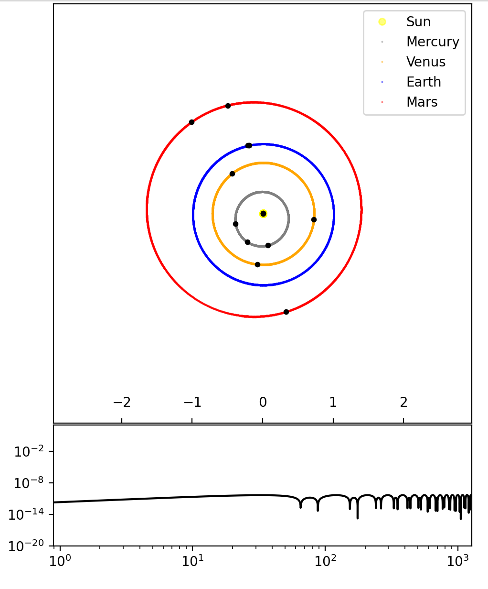
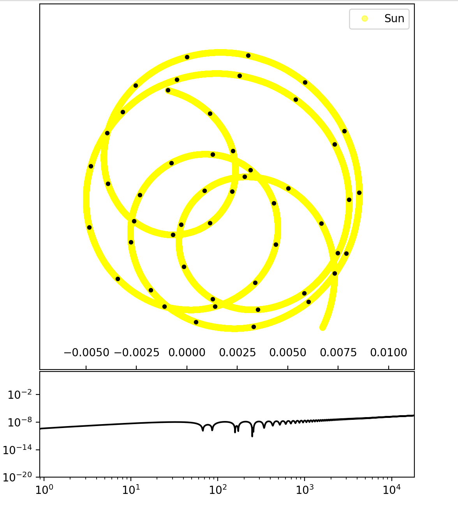
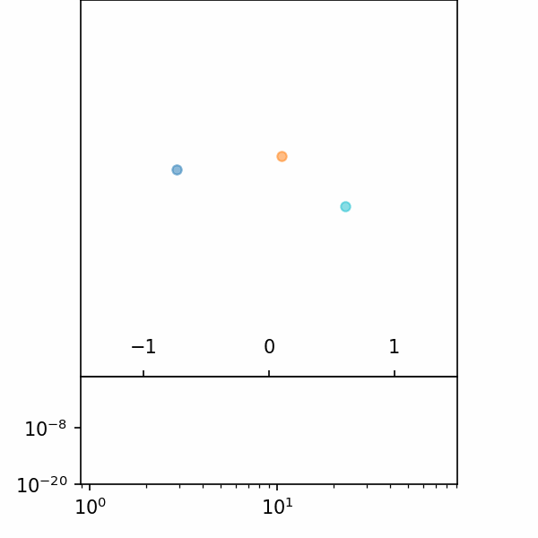
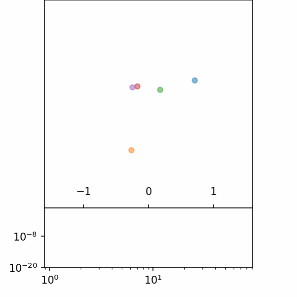

# Orbits

A library for working with orbits in 2D and 3D space.

Includes optional API calls to NASA's HORIZONS system for initial vector data of our solar system bodies.

Provides a variety of options to evolve the orbits, including:

- 4th order symplectic (Forest/Ruth) integrator
- 2nd order symplectic (Verlet) integrator
- 1st order symplectic (Modified Euler) integrator
- Runge-Kutta 4th order (not recommended)

Adaptive time step sizing is also included by default.

Allows for online (i.e. while the simulation is running) and offline (i.e. after the simulation is complete) plotting of the orbits.

## Installation

Only `numpy` is used for calculations, so it is the only major dependency.

`matplotlib` is used for plotting, in combination with `tqdm` for progress bars.

```bash
pip install -e .
```

## Example Usage

```python

from orbits import StarSystem

solar_system = StarSystem.our_solar_system(
    t0='1945-01-01',
    step_size=1E-3)

## Evolve the solar system for a number of days
t = 0
duration =  3 # years
t_end = t + duration * 365.25 # days

## Animate the orbits of the inner solar system
solar_system.plot_orbits(
    t, 
    t_end, 
    indices=[0,1,2,3,4], 
    keep_points="all", 
    resample_every_dt=1,
    animated=False,
    mark_every_dt=1*365.25, 
    real_time=False,
    save=False, 
    adaptive=True, 
    relative_error=1E-5)
```

<div display="flex" align-items="center" justify-content="center">
    
    
</div>

On the upper plot, the scales of the x and y axes are the equal and the units are AU. Each black dot corresponds to January 1st of a year.

The lower plot displays the evolution of the fractional energy change $\Delta E/ E(t=0)$, as a function of time (in days). Since this remains substantially lower than 1, this is an indication that the evolution of the system has not gone horribly wrong.

On the left, the orbits of the inner solar system are shown for a duration of three years. On the right, the motion of the Sun with respect to the Solar System Barycenter is shown over 50 years (see more information [here](https://en.wikipedia.org/wiki/Solar_System_Barycenter) and [here](https://astronomy.stackexchange.com/a/51361/48459)).

Or you can use the `StarSystem` class to create your own star system, and evolve it for a number of days.

```python

from orbits import StarSystem

while True:
    solar_system = StarSystem.random_solar_system(
        n_objects=3,
        step_size=1E-6,
    )
    if solar_system.get_total_energy() < 0:
        break

## Evolve the solar system for a number of days
t = 0
duration =  0.25 # years
t_end = t + duration * 365.25 # days

## Animate the orbits of the inner solar system
solar_system.plot_orbits(
    t, 
    t_end, 
    indices=None, 
    keep_points="all", 
    resample_every_dt=1,
    animated=True,
    mark_every_dt=1*365.25, 
    real_time=False,
    save=False, 
    adaptive=True, 
    relative_error=1E-10)
```

Here is example output for n=3 and n=5. Note the much smaller relative error that the adaptive integrator is able to achieve.

<div display="flex" align-items="center" justify-content="center">
    
    
</div>
